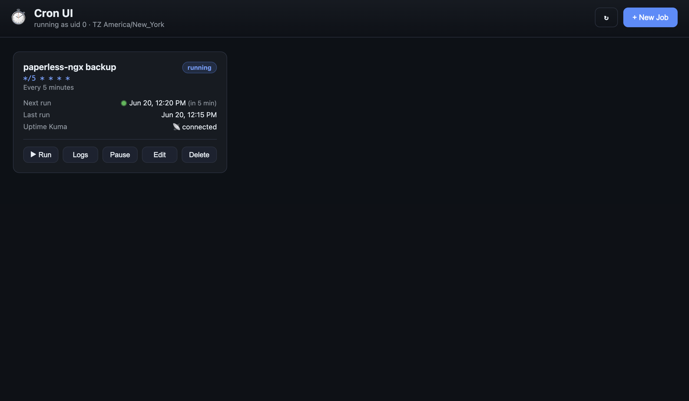

# Cron UI

A small, self-contained **web UI for scheduling and running scripts on cron**, packaged as a single Docker container that runs **as root**. Built for immutable hosts like ZimaOS where there's no persistent host crontab — all state lives on a mounted volume, so jobs survive reboots.

 



## Features

- **Real 5-field cron schedules** (validated with `croniter`, with live "next run" preview).
- **In-browser script editor** — write `sh` or `bash` scripts, no SSH needed. Scripts run via their own shebang, so `#!/usr/bin/env bash` with `set -Eeuo pipefail` works.
- **Runs as root** inside the container; mount host paths or `docker.sock` to act on the host and other containers.
- **AWS CLI v2 built in** — call `aws` directly from any job (creds via per-job env or global compose env).
- **Cross-container docker** — `docker` (run/exec/cp/ps) works against the host daemon via the mounted `docker.sock`.
- **Uptime Kuma integration** — set a push URL per job and cron-ui automatically sends `up` on success / `down` on failure after every run, with duration as ping. No per-script push code needed.
- **Per-job** timezone, environment variables, working directory, and execution timeout.
- **Run history & live log tailing** for every execution (manual or scheduled).
- **Run now**, pause/resume, edit, and delete jobs from the UI.
- **Crash-safe & persistent** — jobs DB, scripts, and logs live under `/data`; `restart: always` brings the scheduler back after any crash or reboot, scripts are re-materialized from the DB on boot, and runs interrupted by a restart are marked `interrupted`.
- **Optional token auth** via `CRON_UI_TOKEN`.
- No external services; one container, SQLite, vanilla-JS frontend.

## Quick start

```bash
docker compose up -d --build
```

Open <http://localhost:8080>.

By default the project mounts `./data` for persistent state and the host's `docker.sock`. Edit `docker-compose.yml` to set your `TZ` and mount any host paths your scripts need.

### On ZimaOS (or any immutable host)

Put persistent state on the data partition so it survives reboots, and (optionally) mount `/DATA` so scripts can act on your files:

```yaml
volumes:
  - /DATA/cron-ui:/data
  - /DATA/AppData:/DATA/AppData   # all other apps' data, same path in/out of the container
  - /DATA:/DATA                   # (optional) everything else on the data disk
  - /var/run/docker.sock:/var/run/docker.sock
```

`/DATA/AppData` is where ZimaOS stores every installed app's data (your `~/AppData`). Mounting it at the **same path** inside the container means a script can reference `/DATA/AppData/<app>/...` and it resolves identically whether run on the host or in cron-ui.

**Building on ZimaOS:** the root filesystem is immutable, so `sudo docker ...` fails with `mkdir /root/.docker: read-only file system` (it can't write Docker's CLI config to the read-only `/root`). Point `DOCKER_CONFIG` at a writable path on `/DATA`:

```bash
sudo DOCKER_CONFIG=/DATA/.docker docker compose up -d --build
```

(If your user is in the `docker` group you can drop `sudo` entirely and just run `docker compose up -d --build`.)

`restart: always` + Docker state on `/DATA` means the scheduler comes back automatically after every reboot — no SSH, no re-creating anything. You can also paste the compose file straight into a Portainer Stack.

## How "as root" works (two tiers)

1. **Default (container root):** scripts run as `root` *inside the container*. This is enough for anything touching mounted data partitions, running `rsync`, or stopping/starting other containers via the mounted `docker.sock`.

2. **True host-level root:** if a script must modify host OS state outside mounted volumes, uncomment `privileged: true` and `pid: host` in `docker-compose.yml`, then call the host through PID 1's namespaces:

```sh
nsenter -t 1 -m -u -i -n -p -- /bin/sh -c '<your host command>'
```

`util-linux` (which provides `nsenter`) is already installed in the image.

## Integrations

### Uptime Kuma

Create a **Push** monitor in Uptime Kuma and copy its push URL, e.g. `http://192.168.0.67:3001/api/push/<token>`. You can paste it exactly as Kuma shows it — cron-ui strips any trailing example query string (`?status=up&msg=OK&ping=`) before sending, because keeping it would create duplicate `status`/`msg` params that Kuma parses as arrays and records as **Down**. Paste it into a job's **Uptime Kuma push URL** field (use **Test** to verify connectivity). After every run cron-ui sends:

- `status=up` with the run duration as `ping` when the script exits `0`
- `status=down` with the exit code/status in `msg` on failure or timeout

This means you can delete the bespoke `kuma_push` helper from scripts like `examples/paperless-ngx_backup.sh` — the platform handles heartbeats centrally. (Leaving an in-script push in place is harmless; both can coexist.)

### AWS CLI

`aws` (v2) is installed in the image, so jobs can run e.g. `aws s3 cp ...` directly. Provide credentials either:

- **Per job** — add `AWS_ACCESS_KEY_ID`, `AWS_SECRET_ACCESS_KEY`, `AWS_DEFAULT_REGION` in the job's env-vars box, or
- **Globally** — set the same vars in `docker-compose.yml` so every job inherits them.

The throwaway-container approach (`docker run ... public.ecr.aws/aws-cli/aws-cli`) used in the sample script also still works, since the docker CLI and socket are available.

### Cross-container docker commands

The docker CLI is installed and `/var/run/docker.sock` is mounted, so jobs can `docker ps`, `docker exec`, `docker cp`, `docker run --rm`, restart containers, etc. — exactly what the Paperless backup sample needs.

## Configuration

All settings are environment variables (set them in `docker-compose.yml`):

| Variable            | Default      | Description                                              |
| ------------------- | ------------ | ------------------------------------------------------- |
| `TZ`                | `UTC`        | Default timezone for jobs and the scheduler.            |
| `CRON_UI_TOKEN`     | _(unset)_    | If set, the UI/API require this token (`X-Auth-Token`). |
| `CRON_UI_DATA`      | `/data`      | Root directory for the DB, scripts, and logs.           |
| `CRON_UI_SHELL`     | `/bin/sh`    | Shell used to execute job scripts.                      |
| `CRON_UI_TICK`      | `5`          | Scheduler poll interval, in seconds.                    |
| `CRON_UI_TIMEOUT`   | `0`          | Default per-run timeout in seconds (0 = none).          |
| `CRON_UI_MAX_RUNS`  | `200`        | Run-history rows kept per job (0 = unlimited).          |

## Data layout (under `/data`)

```
/data
├── cron_ui.db        # jobs + run history (SQLite)
├── scripts/          # one job_<id>.sh per job
└── logs/             # one log file per run
```

## API

The UI is driven by a small JSON API (handy for automation):

| Method   | Path                      | Description                |
| -------- | ------------------------- | -------------------------- |
| `GET`    | `/api/health`             | Status, uid, timezone.     |
| `GET`    | `/api/jobs`               | List jobs (+ next/last run)|
| `POST`   | `/api/jobs`               | Create a job.              |
| `PATCH`  | `/api/jobs/{id}`          | Update a job.              |
| `DELETE` | `/api/jobs/{id}`          | Delete a job.              |
| `POST`   | `/api/jobs/{id}/run`      | Run a job immediately.     |
| `POST`   | `/api/jobs/{id}/toggle`   | Pause / resume.            |
| `GET`    | `/api/jobs/{id}/runs`     | Run history.               |
| `GET`    | `/api/runs/{id}/log`      | Log output for a run.      |
| `POST`   | `/api/validate`           | Validate a cron expression.|
| `POST`   | `/api/kuma/test`          | Send a test Uptime Kuma heartbeat. |

Example:

```bash
curl -X POST http://localhost:8080/api/jobs \
  -H 'Content-Type: application/json' \
  -d '{"name":"backup","schedule":"0 4 * * *","script":"#!/bin/sh\nrsync -a /DATA/src/ /DATA/dst/"}'
```

## Local development (without Docker)

```bash
cd backend
pip install -r requirements.txt
CRON_UI_DATA=../data uvicorn app:app --reload --port 8080
```

## Security notes

- Mounting `docker.sock` and/or running `privileged` grants root-equivalent access to the host. Only expose this UI on a trusted network, and set `CRON_UI_TOKEN`.
- Scripts run as root with whatever you mount — treat the UI as an admin tool.
